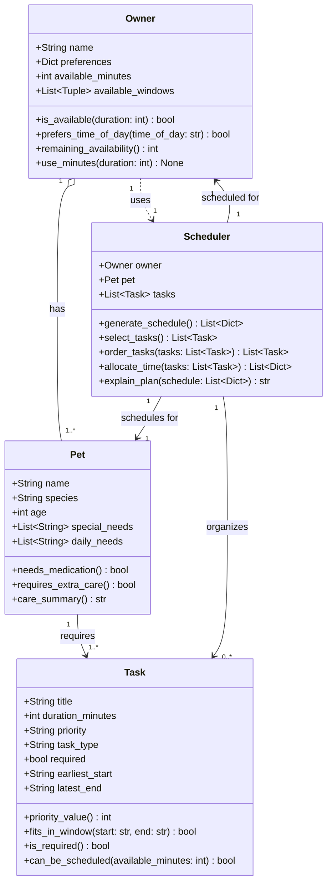

```mermaid
classDiagram
    class Owner {
        +String name
        +Dict preferences
        +int available_minutes
        +List~Tuple~ available_windows
        +is_available(duration: int) bool
        +prefers_time_of_day(time_of_day: str) bool
        +remaining_availability() int
        +use_minutes(duration: int) None
    }

    class Pet {
        +String name
        +String species
        +int age
        +List~String~ special_needs
        +List~String~ daily_needs
        +needs_medication() bool
        +requires_extra_care() bool
        +care_summary() str
    }

    class Task {
        +String title
        +int duration_minutes
        +String priority
        +String task_type
        +bool required
        +String earliest_start
        +String latest_end
        +priority_value() int
        +fits_in_window(start: str, end: str) bool
        +is_required() bool
        +can_be_scheduled(available_minutes: int) bool
    }

    class Scheduler {
        +Owner owner
        +Pet pet
        +List~Task~ tasks
        +generate_schedule() List~Dict~
        +select_tasks() List~Task~
        +order_tasks(tasks: List~Task~) List~Task~
        +allocate_time(tasks: List~Task~) List~Dict~
        +explain_plan(schedule: List~Dict~) str
    }

    Owner "1" o-- "1..*" Pet : has
    Owner "1" ..> "1" Scheduler : uses

    Pet "1" --> "1..*" Task : requires

    Scheduler "1" --> "1" Owner : scheduled for
    Scheduler "1" --> "1" Pet : schedules for
    Scheduler "1" --> "0..*" Task : organizes
```
