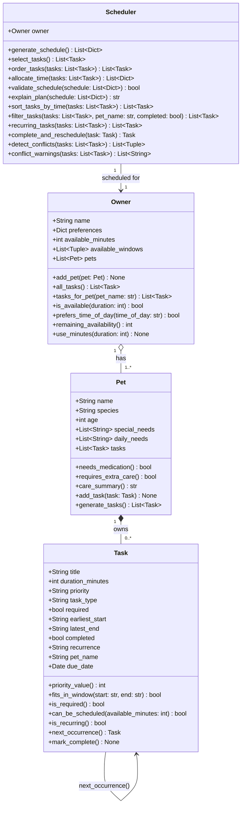

```mermaid
classDiagram
    class Task {
        +String title
        +int duration_minutes
        +String priority
        +String task_type
        +bool required
        +String earliest_start
        +String latest_end
        +bool completed
        +String recurrence
        +String pet_name
        +Date due_date
        +priority_value() int
        +fits_in_window(start: str, end: str) bool
        +is_required() bool
        +can_be_scheduled(available_minutes: int) bool
        +is_recurring() bool
        +next_occurrence() Task
        +mark_complete() None
    }

    class Pet {
        +String name
        +String species
        +int age
        +List~String~ special_needs
        +List~String~ daily_needs
        +List~Task~ tasks
        +needs_medication() bool
        +requires_extra_care() bool
        +care_summary() str
        +add_task(task: Task) None
        +generate_tasks() List~Task~
    }

    class Owner {
        +String name
        +Dict preferences
        +int available_minutes
        +List~Tuple~ available_windows
        +List~Pet~ pets
        +add_pet(pet: Pet) None
        +all_tasks() List~Task~
        +tasks_for_pet(pet_name: str) List~Task~
        +is_available(duration: int) bool
        +prefers_time_of_day(time_of_day: str) bool
        +remaining_availability() int
        +use_minutes(duration: int) None
    }

    class Scheduler {
        +Owner owner
        +generate_schedule() List~Dict~
        +select_tasks() List~Task~
        +order_tasks(tasks: List~Task~) List~Task~
        +allocate_time(tasks: List~Task~) List~Dict~
        +validate_schedule(schedule: List~Dict~) bool
        +explain_plan(schedule: List~Dict~) str
        +sort_tasks_by_time(tasks: List~Task~) List~Task~
        +filter_tasks(tasks: List~Task~, pet_name: str, completed: bool) List~Task~
        +recurring_tasks(tasks: List~Task~) List~Task~
        +complete_and_reschedule(task: Task) Task
        +detect_conflicts(tasks: List~Task~) List~Tuple~
        +conflict_warnings(tasks: List~Task~) List~String~
    }

    Owner "1" o-- "1..*" Pet : has
    Pet "1" *-- "0..*" Task : owns
    Scheduler "1" --> "1" Owner : scheduled for
    Task --> Task : next_occurrence()
```
